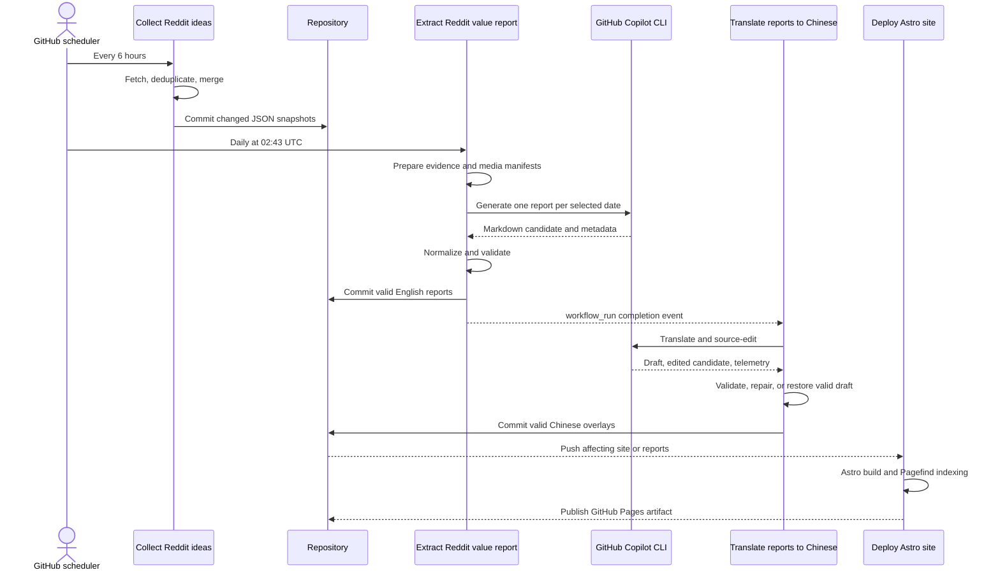

# Idea

Source-linked Reddit builder intelligence, generated as validated English and
Simplified Chinese reports and published as a static Astro website.

Live site: [idea.genisisiq.com](https://idea.genisisiq.com/)

## What the system does

The repository turns public Reddit discussions into daily, evidence-grounded
builder reports:

1. Collect posts and selected comments from configured communities.
2. Preserve the daily snapshots as immutable JSON inputs.
3. Rank evidence, resolve external links, and inspect useful media.
4. Generate one structured English report for each complete UTC day.
5. Validate structure, provenance, links, metrics, media coverage, and safety.
6. Translate valid reports into native Simplified Chinese with a source-anchored
   editing pass and a second validation gate.
7. Build a bilingual static site, RSS feed, sitemap, and browser-side search
   index.
8. Deploy the result to GitHub Pages.

The design deliberately separates probabilistic model work from deterministic
publication rules. Models propose reports and translations; code decides
whether they are safe and complete enough to publish.

## Architecture

```mermaid
flowchart LR
  Reddit[Public Reddit communities]
  Cookie[Cookie refresher]
  Collector[Reddit collector]
  Raw[(data/reddit daily JSON)]
  Prepare[Evidence ranking and preparation]
  Media[Link and media processing]
  Analyst[Copilot analysis agent]
  ValidateEN[English report validator]
  Reports[(reports/reddit English Markdown)]
  Translator[Copilot translator and editor]
  ValidateZH[Chinese translation validator]
  Overlays[(reports/reddit/zh Markdown)]
  Astro[Astro static site]
  Search[Pagefind search, RSS, sitemap]
  Pages[GitHub Pages]
  Diagnostics[(ignored artifacts and telemetry)]

  Cookie -. refreshes REDDIT_COOKIES .-> Collector
  Reddit --> Collector
  Collector --> Raw
  Raw --> Prepare
  Prepare --> Media
  Media --> Analyst
  Analyst --> ValidateEN
  ValidateEN -->|valid| Reports
  ValidateEN -->|invalid| Diagnostics
  Reports --> Translator
  Translator --> ValidateZH
  ValidateZH -->|valid| Overlays
  ValidateZH -->|invalid| Diagnostics
  Reports --> Astro
  Overlays --> Astro
  Astro --> Search
  Search --> Pages
```



### System components

| Component | Main location | Responsibility | Persistent output |
|---|---|---|---|
| Reddit collector | `pipeline/src/idea_pipeline/scraper/` | Fetch posts and selected comments, deduplicate, and merge partial results safely | `data/reddit/<topic>/<date>.json` |
| Evidence analyzer | `pipeline/src/idea_pipeline/analyzer/` | Rank evidence, build dossiers/manifests, materialize supported media, invoke Copilot, normalize, and validate | `reports/reddit/<date>.md` |
| Analysis specification | `.agents/skills/reddit-idea-analysis/SKILL.md` | Define the report contract, evidence bar, media handling, and safety boundary | Included in each analysis sandbox |
| Chinese translator | `pipeline/src/idea_pipeline/translator/` | Translate, source-edit, repair, validate, and publish Chinese overlays | `reports/reddit/zh/<date>.md` |
| Translation specification | `.agents/skills/translate-zh/SKILL.md` | Define native-Chinese writing rules, protected facts, terminology, structure, and self-review | Included in each translation sandbox |
| Cookie refresher | `pipeline/src/idea_pipeline/refresher/` | Renew the browser session and replace the encrypted Actions secret | `REDDIT_COOKIES` repository secret |
| Website | `src/`, `astro.config.mjs` | Load versioned Markdown directly, render reports, derive metadata, and build bilingual routes | Static files under `dist/` |
| Automation | `.github/workflows/` | Schedule collection, analysis, translation, refresh, and deployment | Commits, artifacts, telemetry, and Pages deployments |

## Data ownership and invariants

| Data | Owner | Rule |
|---|---|---|
| `data/reddit/` | Collector | Immutable analysis input. Collection merges snapshots, but analysis and Astro never rewrite them. |
| `reports/reddit/*.md` | Analyzer | Derived English output. Only a normalized, validated candidate is published. |
| `reports/reddit/zh/*.md` | Translator | Source-linked overlay. Its recorded source digest and quality version must match the English report. |
| `pipeline/artifacts/` | Pipeline stages | Ignored working state: prompts, manifests, media, candidates, logs, validation results, and telemetry. |
| `src/` and `public/` | Astro application | Read reports and data at build time; never mutate pipeline-owned content. |
| `dist/` | Astro/Pagefind build | Disposable static deployment output. |

Secrets stay under the Python pipeline boundary. `pipeline/.env` is ignored, and
the Astro site does not receive Reddit cookies, Copilot credentials, or GitHub
secret-management tokens.

## End-to-end automated workflow



### 1. Cookie refresh

Reddit access uses a browser-exported session rather than an OAuth refresh
token. Every third day at 01:23 UTC, Playwright opens Reddit with the current
cookies, captures the renewed cookie set, encrypts it with GitHub's repository
public key, and replaces the `REDDIT_COOKIES` Actions secret.

Successful runs remain in Actions and retain a screenshot artifact for seven
days. A `cookie-refresh` GitHub issue is created only when the refresh fails.

### 2. Collection

`.github/workflows/scrape_reddit.yml` runs every six hours:

- load topic and subreddit quotas from `pipeline/config/scraper/reddit.yml`;
- install the current cookie set for `rdt-cli`;
- fetch posts with conservative jitter and selected high-value comments;
- deduplicate by Reddit ID across communities;
- preserve successful partial results when one community fails;
- atomically merge the batch into daily topic snapshots;
- commit only changed files under `data/reddit/`.

The current three streams are `customer-pain`, `startup-ideas`, and
`saas-build`. A date becomes eligible for analysis only when all required
streams exist.

### 3. English analysis

`.github/workflows/analyze_reddit.yml` runs daily at 02:43 UTC and defaults to
the newest missing completed date:

1. Rank each stream independently by evidence richness rather than raw
   engagement alone.
2. Build compact historical context, external-link manifests, media manifests,
   source hashes, and per-item dossiers.
3. Download only approved direct images; normalize unsupported image formats;
   convert accessible Reddit videos into six-frame contact sheets.
4. Launch one sandboxed Copilot CLI process per selected date. Shell access,
   built-in GitHub MCP access, unrelated credentials, and unrestricted web
   access are withheld.
5. Normalize safe mechanical drift and validate the candidate.
6. Publish valid Markdown atomically and leave existing reports untouched when
   generation or validation fails.

The report contract has five sections:

1. Executive Brief
2. Evidence Ledger
3. Customer Problems and Existing Workarounds
4. Patterns, Contradictions, and Gaps
5. Decisions and Watchlist

Projects, launches, validation, failures, outcomes, and visual proof share one
case-level evidence ledger instead of being repeated across separate
inventories.

### 4. Chinese translation

`.github/workflows/translate_zh.yml` starts after the analysis workflow
completes. A 06:17 UTC schedule provides recovery when the completion event is
delayed or missed.

For each missing, stale, or older-quality overlay:

1. Freeze the exact English source, Markdown structure, protected terms, and
   uncertainty qualifiers in a sandbox.
2. Generate a full-document Simplified Chinese draft.
3. Normalize and hard-validate the draft.
4. Save the valid first pass as a recovery point.
5. Run a source-anchored editor that sees both the English source and Chinese
   draft.
6. Validate the edited candidate again.
7. Attempt one focused repair for specific validator failures.
8. Restore the valid draft if editing or repair remains invalid.
9. Publish the overlay with source digest, quality version, model, editor model,
   and timestamp metadata.

The target is native Chinese technology journalism, not sentence-by-sentence
conversion. Facts, numbers, links, names, images, qualifiers, and document
shape remain exact.

### 5. Static publishing

Astro content collections load `reports/reddit/*.md` and
`reports/reddit/zh/*.md` directly. The site derives report titles, dates,
summaries, reading time, citation counts, archive cards, and signal groups
without duplicating report content under `src/`.

Custom Markdown plugins render evidence cases, tables, images, galleries, and
expandable media. The build produces:

- English and Chinese home, archive, methodology, and report routes;
- `/rss.xml`;
- a sitemap;
- two Pagefind language indexes;
- static HTML/CSS/JavaScript with no server runtime or private environment
  variables.

`.github/workflows/deploy_site.yml` deploys to GitHub Pages after relevant
pushes and after successful analysis workflow completion.

## Model provider and routing

All generative work goes through **GitHub Copilot CLI**. The repository does not
embed direct OpenAI, Google, xAI, or Anthropic API clients. Copilot provides one
authentication boundary (`COPILOT_PAT`), a common sandboxed execution path,
model switching, and consistent usage metadata.

| Stage | Default | Fallback | Why |
|---|---|---|---|
| English report synthesis | `gpt-5.4-mini`, medium effort | `grok-4.5`, high effort | Use a lower-cost model for structured synthesis; escalate only after generation or validation failure. |
| Chinese first pass | `gpt-6-luna`, medium effort | `gpt-6-sol`, high effort | Luna produced the best quality/cost result in the repository benchmark; Sol is reserved for hard cases. |
| Chinese source editor | `gpt-6-luna`, medium effort | Restore the validated first pass if editing and focused repair fail | Editing improves native phrasing but is never allowed to damage an already valid translation. |
| Collection, validation, refresh, site build | No model | None | Deterministic code is faster, cheaper, and more reliable for these operations. |

Manual workflow runs can select other supported Copilot models for controlled
experiments. A model should not replace a production default merely because it
is newer: rerun the same difficult samples, deterministic validators, blind
review, timing comparison, and cost comparison first.

### Translation benchmark decision

The production route was selected using hard validation, manual review, and
three blind model judges:

- Luna translation plus Luna editing scored **89.67**, the best aggregate
  result.
- Tested Sol routes scored **86.33-87.67** and cost materially more.
- The previous Gemini output scored **73** and did not meet the new contract.
- One-pass Luna was cheaper but dropped an uncertainty qualifier on a difficult
  report.
- Grok was slower, more expensive, and too conversational for the target
  register.

The completed 53-report backfill used Luna/Luna for 51 reports and Sol/Luna for
2 fallback reports. Successful generation telemetry totaled about **$3.1572**,
or **$0.0619 per report**, excluding two discarded failed attempts. Model
pricing changes over time, so this is an observed result, not a permanent price
guarantee.

## Quality design

### Source fidelity

- Raw snapshots are retained and never rewritten by downstream stages.
- Reports cite Reddit posts and external artifacts rather than presenting model
  memory as evidence.
- Unknown or ungrounded destinations are not allowed to become clickable
  sources.
- Metrics, identifiers, project names, Reddit titles, URLs, and uncertainty
  qualifiers are protected during translation.

### Deterministic publication gates

English validation checks core sections, case shape, required tables, source
coverage, links, Reddit IDs, media accounting, inspected-image inclusion,
insecure embeds, local paths, and malformed review data.

Chinese validation checks source digests, heading order, case order, all eight
case fields, table dimensions, URL and image sets, protected terms, metrics,
project names, quoted titles, every uncertainty qualifier, structural status
values, and high-confidence translationese patterns.

Advisory quality targets are recorded separately from blocking failures so a
useful, source-grounded report is not discarded for a non-critical coverage
gap.

### Media accountability

Every detected media item receives a deterministic status in the media ledger.
Direct images can be attached to the analysis agent and embedded in the
matching case. Reddit videos become contact sheets when accessible. Galleries,
external videos, unavailable files, and non-substantive media remain explicit
rather than disappearing silently.

### Safe model execution

- One isolated sandbox is created per date.
- Prompts include only the required source material and contracts.
- Shell and unrelated MCP capabilities are disabled for model subprocesses.
- Pipeline credentials unrelated to the current stage are removed.
- A failed model process cannot overwrite a previously published report.
- Translation editing cannot replace a valid draft with an invalid result.

### Release quality

- English and Chinese outputs are committed only after validation.
- Astro type/content checks run before release.
- Static generation must complete for all routes.
- Pagefind indexes both languages after Astro finishes.
- Diagnostics are retained for failed runs; telemetry is retained for trend and
  cost analysis.

## Processing time, throughput, and cost

Recent successful GitHub-hosted runs provide the following operational
expectations. They are examples, not SLAs; Reddit latency, media volume, model
queues, cache behavior, and fallback work can change them.

| Stage | Schedule/default scope | Representative time | Guardrail |
|---|---|---:|---|
| Cookie refresh | Every third day | About 1 minute | Failure creates an issue; screenshot retained 7 days |
| Collection | Every 6 hours, all configured streams | About 6-7 minutes | Partial successful batches are preserved |
| English analysis | Daily, newest one missing date, 2 workers available | About 30 minutes for a recent successful report | 6-hour workflow timeout; expensive fallback only after failure |
| Chinese translation | After analysis, up to 5 overlays, 1 worker | Under 1 minute for a no-op; about 9 minutes for a recent work-bearing run | 20-minute timeout per generation/edit/repair stage; 6-hour workflow timeout |
| Astro/Pagefind deploy | On relevant pushes | About 40-90 seconds | Previous deployment remains live if build fails |

Throughput controls prevent unattended jobs from consuming an entire backlog:

- automatic analysis defaults to one newest missing report;
- automatic translation defaults to five overlays;
- workers are bounded and configurable;
- generation, editing, and repair record elapsed time, exit status, token use,
  and cache use;
- first-pass success is never regenerated by a fallback model.

Use GitHub Actions for normal daily processing. Run historical analysis and
translation backfills locally, validate the complete batch, then push the
versioned outputs. When a report contract changes, regenerate old reports from
the preserved raw snapshots rather than maintaining legacy rendered formats.

## GitHub Actions

| Workflow | Trigger | Writes |
|---|---|---|
| `scrape_reddit.yml` | `17 */6 * * *` and manual | `data/reddit/` |
| `analyze_reddit.yml` | `43 2 * * *` and manual | `reports/reddit/*.md` |
| `translate_zh.yml` | Analysis completion, `17 6 * * *`, and manual | `reports/reddit/zh/*.md` |
| `refresh_reddit_cookies.yml` | `23 1 */3 * *` and manual | `REDDIT_COOKIES`; failure issue only |
| `deploy_site.yml` | Relevant push, successful analysis completion, and manual | GitHub Pages |

Analysis and translation workflows expose date, limit, force, prepare-only,
model, effort, and worker controls for targeted recovery and benchmarking.

## Repository layout

```text
.
├── .agents/skills/                 # Analysis and translation contracts
├── .github/workflows/              # Collection, generation, refresh, deployment
├── data/reddit/                    # Versioned immutable daily snapshots
├── pipeline/
│   ├── config/
│   │   ├── scraper/reddit.yml
│   │   └── refresher/reddit.yml
│   ├── src/idea_pipeline/
│   │   ├── analyzer/
│   │   ├── scraper/
│   │   ├── translator/
│   │   └── refresher/
│   ├── tests/
│   └── README.md                   # Detailed pipeline reference
├── reports/reddit/                 # Validated English reports
│   └── zh/                         # Validated Chinese overlays
├── src/                            # Astro pages, layouts, components, plugins
├── public/                         # Static website assets
├── astro.config.mjs
└── package.json
```

## Requirements and setup

- Python 3.12+
- [`uv`](https://docs.astral.sh/uv/)
- Node.js 22.12+ and npm
- [`rdt-cli`](https://pypi.org/project/rdt-cli/)
- GitHub Copilot CLI
- Chromium through Playwright
- `ffmpeg` for Reddit video contact sheets

```bash
uv sync --project pipeline
uv tool install rdt-cli
uv run --project pipeline playwright install chromium
npm install
```

Keep local pipeline credentials in `pipeline/.env`:

```dotenv
REDDIT_COOKIES='[{"name":"reddit_session","value":"replace-with-your-value"}]'
COPILOT_GITHUB_TOKEN='replace-with-your-token'
GH_TOKEN='replace-with-your-repository-token'
GITHUB_REPOSITORY='vibewatch/idea'
```

Never commit this file.

### Repository Actions secrets

| Secret | Purpose |
|---|---|
| `REDDIT_COOKIES` | Browser-exported JSON used by collection and refresh |
| `COPILOT_PAT` | Copilot CLI authentication for analysis and translation |
| `GH_PAT` | Narrowly scoped token used to replace the cookie secret and create refresh-failure issues |

## Local operations

### Collect data

```bash
uv run --project pipeline scrape-reddit
uv run --project pipeline scrape-reddit --name saas-build
```

### Prepare or generate English reports

```bash
uv run --project pipeline analyze-reddit --prepare-only
uv run --project pipeline analyze-reddit
uv run --project pipeline analyze-reddit --date 2026-09-23 --force
```

### Prepare or generate Chinese overlays

```bash
uv run --project pipeline translate-zh --prepare-only
uv run --project pipeline translate-zh
uv run --project pipeline translate-zh --date 2026-09-23 --force
```

### Refresh cookies

```bash
uv run --project pipeline refresh-cookies
uv run --project pipeline refresh-cookies --headless
```

### Run the website

```bash
npm run dev
```

Development is served at `http://localhost:4321/`.

## Validation and build

```bash
uv run --project pipeline pytest pipeline/tests -v
uv run --project pipeline ruff check pipeline
npm run check -- --minimumFailingSeverity error
npm run build
```

`npm run build` prerenders the complete bilingual site and then builds the
Pagefind indexes in `dist/pagefind/`.

To test another public origin or base path:

```bash
ASTRO_SITE=https://vibewatch.github.io ASTRO_BASE=/idea npm run build
```

## Website routes

- `/` and `/zh/` - latest report and archive summary
- `/reports/` and `/zh/reports/` - chronological archives
- `/reports/<YYYY-MM-DD>/` and `/zh/reports/<YYYY-MM-DD>/` - report pages
- `/about/` and `/zh/about/` - methodology
- `/rss.xml` - report feed

## Further documentation

See [`pipeline/README.md`](pipeline/README.md) for scraper configuration,
snapshot format, detailed analyzer and translator behavior, cookie bootstrap,
and subsystem-specific commands.
